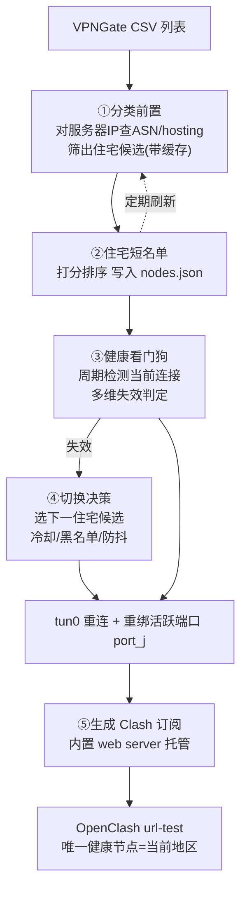
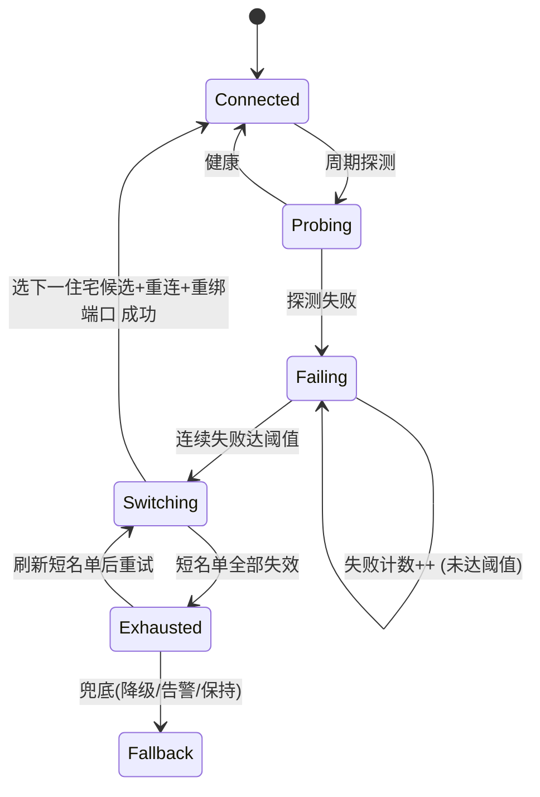

# huayu 魔改方案:住宅 IP 节点列表化 + 自动切换 + OpenClash 接入

<aside>
🎯

本文档是对 [huayugate](https://github.com/wanghuayu666/huayugate) 的魔改实施方案,目标:**①** 把住宅候选节点列表化导入 OpenClash,在面板里看到"当前连的是哪个地区";**②** 在 huayu 内部加"住宅 IP 失效→自动切换到可用住宅 IP"的看门狗。底层维持**单隧道(一次一个 IP)**架构,适配 2C/2.4G 的 VPS。

</aside>

## 0. TL;DR(一页看懂)

- 项目出口本质 = **一个固定的 SOCKS5/HTTP 代理端口 + 把所有流量绑死到 `tun0`**;`tun0` 连哪台 VPNGate 服务器,出口就是哪个 IP。**全机一次只有一个 `tun0`,所以一次只有一个出口 IP。**
- 它**没有用 3X-UI**,代理是项目自写的纯 Python 服务(`proxy_server.py`)。
- **增强一**靠"每个候选节点分配稳定端口 + 只开当前活跃端口",让 OpenClash 的 url-test 组里"唯一健康的那个节点名"= 当前地区。
- **增强二**复用它已有的"智能自动配置"漂移框架,把**候选源换成住宅短名单**、把**失效判定换成更强的看门狗**。
- 两者**串联成闭环**:看门狗切换 → 重绑活跃端口 → OpenClash 自动跟随显示新地区。

---

## 1. 项目出口机制(必须先理解)

源码 `proxy_server.py` 的核心:每条转发连接(含 DNS 查询)都执行

```python
sock.setsockopt(socket.SOL_SOCKET, socket.SO_BINDTODEVICE, b"tun0")
```

即**强制绑定到 `tun0`(OpenVPN 隧道网卡)**。因此:

<aside>
💡

**入口固定、出口可变**:OpenClash 永远连 `vps:端口`(地址不变),而出口 IP 由"当前 `tun0` 连的是哪台 VPNGate 服务器"决定。在 huayu 切换节点 = 让 `tun0` 重连到另一台服务器,出口 IP 就透明地变了。

</aside>

| 事实 | 结论 |
| --- | --- |
| 全机只有一个 `tun0` | 一次只有一个出口 IP(你的判断正确) |
| 原因是单隧道设计,不是 3X-UI | 不存在 3X-UI 依赖 |
| 代理端口可参数化(`start_proxy_server(host, port)`) | 可改造为"按活跃节点切换监听端口" |
| `state.json` 已含 `proxy_ok/proxy_ip/proxy_error/proxy_latency_ms` | 项目本就在做出口健康探测,看门狗可直接复用 |

---

## 2. 总体架构



---

## 3. 增强一:节点列表化 + 当前地区可见

### 3.1 设计要点

Clash 节点名是**静态**的,无法动态改名。要在 OpenClash 原生面板看到"当前地区",唯一办法:**把每个住宅候选做成一个带地区名的独立节点,同一时刻只让"当前生效"的那个健康,其余全部连不通**。那个唯一健康节点的名字就是当前地区。

### 3.2 端口映射法

```
为每个住宅候选分配稳定端口:  node_i -> port_i   (写入 nodes.json,与订阅一致)
建议规则:  port_i = 20000 + 短名单序号

当前连 node_k 时:  只在 port_k 监听代理(其余端口不开)
  -> OpenClash 里只有 "node_k-地区名" 能连通
切换到 node_j 时:  关 port_k -> tun0 重连 node_j -> 开 port_j
  -> url-test 检测到 k 死、j 活 -> 自动跳到 "node_j-地区名"
```

<aside>
🔧

**改动点**:`proxy_server.start_proxy_server(host, port)` 本就接受端口参数;魔改让"当前活跃节点决定监听端口",切换时**先关旧监听 socket、再用新端口重新 bind/listen**。映射关系必须**稳定**且与生成的订阅一致。

</aside>

### 3.3 订阅生成 + OpenClash 配置

新增"导出订阅"函数,把住宅短名单全部列出(复用项目内置 web server 托管为 `http://vps:8787/<secret>/sub.yaml`):

```yaml
proxies:
	- { name: "JP-东京-1.2.3.4", type: socks5, server: <vps_ip>, port: 20000, username: u, password: p, udp: true }
	- { name: "US-洛杉矶-5.6.7.8", type: socks5, server: <vps_ip>, port: 20001, username: u, password: p, udp: true }
	# ... 短名单全部列出
proxy-groups:
	- name: "🏠住宅出口"
		type: url-test
		url: http://www.gstatic.com/generate_204
		interval: 30          # 自检间隔越短 跟随切换越快
		tolerance: 50
		proxies: ["JP-东京-1.2.3.4", "US-洛杉矶-5.6.7.8"]
rules:
	- MATCH,🏠住宅出口
```

OpenClash:`配置订阅 → 添加该 URL(类型 Clash)→ 勾选自动更新(预约模式)`。**只有短名单变化时才需重生成订阅。**

### 3.4 权衡

<aside>
⚠️

切换瞬间有 gap = `tun0 重连(几秒)` + `OpenClash 一个 url-test 间隔`。注意纯方案也躲不开 tun0 重连那几秒;把 `interval` 压到 30s 内即可接受。想更无缝可用"双端口架构"(OpenClash 走固定 7928 路由 + 另开只读指示端口看地区),但更复杂,**一般推荐就用上面的单一 url-test 架构**。

</aside>

---

## 4. 增强二:住宅感知的自动切换(看门狗)

<aside>
📌

**复用而非重写**:huayu 已自带"智能自动配置"漂移(节点失效会自动漂到备用健康节点)。本增强=把它的**候选源换成住宅短名单** + **失效判定换成下面更强的看门狗**。

</aside>

### 4.1 ①分类前置(关键省资源优化)

出口 IP = VPNGate 服务器自身 IP,而服务器 IP 在 CSV 里就有,**所以不用先拨号即可分类**,只对判为"住宅"的才去拨号验证。

- 用 `ip-api.com`(免费 45 次/分,含 `hosting/proxy/mobile` 字段):`hosting==false && proxy==false` 才进住宅候选;叠加机房 ASN 黑名单(OVH/AWS/Hetzner/DO/Linode…)。
- **按 IP 缓存分类结果**(ASN 几乎不变),稳态几乎零开销。

```bash
curl -s "http://ip-api.com/json/<server_ip>?fields=status,country,isp,as,hosting,proxy,mobile"
# 规则: hosting==false && proxy==false  -> 住宅候选
```

### 4.2 ②住宅短名单(nodes.json 字段扩展)

给每个节点增加字段:

| 字段 | 含义 |
| --- | --- |
| `is_residential` | 是否判为住宅(进自动切换池的前提) |
| `score` | 综合评分(延迟 + 历史成功率) |
| `assigned_port` | 增强一的稳定端口映射 |
| `fail_count` | 连续失败计数 |
| `cooldown_until` | 黑名单冷却到期时间戳 |

自动切换只在 `is_residential==true` 且 `now > cooldown_until` 的节点里按 `score` 选。

### 4.3 ③看门狗:"失效"如何定义(决定成败)

基于 `state.json` 已有的 `proxy_ok/proxy_ip/proxy_error/proxy_latency_ms`,**失效 = 满足任一**:

- [ ]  `proxy_ok == false` 或 `tun0` 不存在(隧道级失效)
- [ ]  连续 N 次探测超时 / 延迟超阈值(质量劣化)
- [ ]  周期性 `curl` 你真正在意的目标站失败(判断被墙/被拉黑)
- [ ]  (可选)重新分类发现当前出口 IP 已不再住宅 / 已进黑名单库

用**连续失败计数 + 滞回**避免抖动(偶发一次超时不切)。

### 4.4 ④切换决策状态机



切换规则:

1. 从短名单按 `score` 选下一个,**跳过当前失败的**;
2. 失败节点 `fail_count++`,超阈值则 `cooldown_until = now + TTL`(黑名单一段时间);
3. **最小驻留时间**:刚切过来 X 分钟内不再切,防 flapping;
4. **兜底**:短名单全失效时的策略——降级到任意可用节点 / 暂停并告警 / 保持上一个并重试。**此条必须有**,否则住宅池枯竭会空切。

---

## 5. 两个增强如何协同(闭环)


看门狗(增强二)触发切换 → 重绑端口(增强一)→ OpenClash 自动跟随显示新地区。一条链路同时满足"自动保活 + 当前地区可见"。

---

## 6. 数据结构改动汇总

- nodes.json(候选节点表)新增/使用字段
    
    ```json
    [
      {
        "id": "node-xxxx",
        "ip": "1.2.3.4",
        "remote_host": "...",
        "location": "JP-Tokyo",
        "country": "JP",
        "is_residential": true,
        "score": 82,
        "assigned_port": 20000,
        "fail_count": 0,
        "cooldown_until": 0
      }
    ]
    ```
    
- state.json(运行状态,大部分已存在)
    
    ```json
    {
      "active_openvpn_node_id": "node-xxxx",
      "is_connecting": false,
      "proxy_ok": true,
      "proxy_ip": "1.2.3.4",
      "proxy_latency_ms": 320,
      "proxy_error": "",
      "active_node_latency": "120 ms",
      "active_listen_port": 20000
    }
    ```
    

---

## 7. 实施落点(改哪些文件 / 函数)

| 文件 | 改动 |
| --- | --- |
| `proxy_server.py` | `start_proxy_server` 端口已参数化;新增"按活跃节点重绑监听端口"(关旧 socket → 用 `assigned_port` 重新 bind/listen) |
| `vpngate_manager.py`(主逻辑,~230KB) | ①节点拉取后插入**分类前置**,给 `nodes.json` 打 `is_residential/score/assigned_port`;②定位现有**自动漂移/节点切换函数**,改候选源为住宅短名单 + 接入新看门狗失效判定;③新增**导出 Clash 订阅**函数 + 静态路由(复用内置 web server) |
| 配置面 | `LOCAL_PROXY_USER/PASS` 加密码;端口映射表;看门狗阈值 |

<aside>
🔍

`vpngate_manager.py` 体量很大,实施时先在其中**搜索定位**:节点列表加载/保存(读写 `nodes.json`)、活跃节点切换/漂移逻辑(写 `active_openvpn_node_id`)、出口健康探测(写 `proxy_ok/proxy_ip`)这三处,改造都围绕它们展开。

</aside>

---

## 8. 关键配置参数

| 参数 | 建议值 | 说明 |
| --- | --- | --- |
| 看门狗探测间隔 | 15–30 s | 越短越灵敏,越耗资源 |
| 连续失败阈值 N | 2–3 | 防偶发抖动 |
| 单节点延迟阈值 | 1500–2500 ms | 超过视为劣化 |
| 黑名单冷却 TTL | 30–60 min | 避免反复撞坏节点 |
| 最小驻留时间 | 3–5 min | 防 flapping |
| OpenClash url-test interval | 30 s | 跟随切换速度 |
| 端口映射基址 | 20000+序号 | 与订阅严格一致 |

---

## 9. 2C2G 资源 / 风险 / 现实

| 项 | 说明 |
| --- | --- |
| 内存 | **单 tun0**(非多隧道),内存压力极小,你的机器够用 |
| 分类开销 | 结果缓存后稳态几乎为零;首次全量分类受 45 次/分限速,需分批 |
| 主要风险 | 住宅短名单可能很小 → 频繁切换/无可切 → 靠冷却+最小驻留+兜底压住 |
| 体验上限 | VPNGate 节点质量决定;自动切换保"尽量有可用 IP",保不了"高速稳定" |

<aside>
🚨

**现实警告**:VPNGate 整段 IP 多被风控厂商标记为 public VPN。即使某节点物理上是家庭宽带,也可能已被打上 VPN/proxy 标签,在严格风控场景(流媒体解锁/注册/反爬)照样被拦。`ip-api hosting=false` 只代表"不是机房",**不等于"干净可用住宅"**。建议先跑分类前置,看短名单到底剩几个,再决定投入。

</aside>

---

## 10. 部署与验证步骤(改完后)

1. **加密码 + 暴露策略**:设 `LOCAL_PROXY_USER/PASS`;优先用 `autossh`/WireGuard 把端口隧道到 OpenWrt,而非裸暴露公网 SOCKS;若暴露公网,防火墙仅放行你家公网 IP。
2. **跑分类前置**:确认 `nodes.json` 里 `is_residential` 短名单规模与质量。
3. **生成订阅**:访问 `http://vps:8787/<secret>/sub.yaml` 确认节点列表正确、端口与映射一致。
4. **OpenClash 订阅**:添加 URL → 自动更新 → 选 `🏠住宅出口` 组,确认"唯一健康节点"= huayu UI 当前节点。
5. **验证自动切换**:在 huayu 手动"杀掉"当前隧道或等其失效,观察看门狗是否自动切到下一个住宅候选,且 OpenClash 在一个 interval 内跟随到新地区节点。
6. **调参**:按抖动情况调失败阈值/冷却 TTL/最小驻留。

---

## 11. 安全加固清单

- [ ]  代理开启账号密码(`LOCAL_PROXY_USER/PASS`),不裸暴露公网
- [ ]  优先 SSH/WireGuard 隧道承载家→VPS 这一跳(SOCKS 本身明文)
- [ ]  防火墙白名单限制可访问端口的来源 IP
- [ ]  给整套服务设 systemd `MemoryMax`,防 OOM 误杀其他服务
- [ ]  检测/拨号失败的 netns/进程及时回收(若后续扩展)

<aside>
✅

**结论**:方向正确、架构成立、对 2C2G 无压力。核心工作量在"分类前置"与"改造现有 auto-drift 的候选源 + 失效判定"两块,其余多为复用。唯一压不住的是 VPNGate 节点质量与住宅稀缺——它决定体验上限,不影响方案落地。

</aside>
